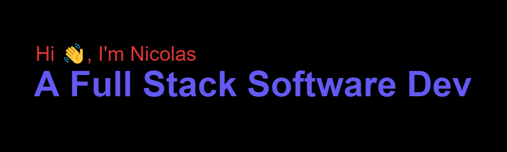

 

I'm a graduate full stack software developer from France. I'm currently working as a full stack developer at <a href="https://exotrail.com/">Exotrail</a> in Toulouse until February the 28th 2022.

**About me**

- 💼 Full stack software developer at [Exotrail](https://exotrail.com/).

- 📈 I have a passion for software development and a strong desire to learn new technologies.

- ❤️ I love Vue, Angular, JavaScript, TypeScript, Java Spring Boot and everything web-related.

- 💬 You can contact me on GitHub, [LinkedIn](https://www.linkedin.com/in/nicolas-martins-a7316212b/) or by <a href="mailto:nicolas.martins@hotmail.fr">email</a>.

**Languages and Tools:**

<code></code>
<code></code>
<code></code>
<code></code>
<code></code>

|  |  |
| --------------------------------------------------------------------------------------------------------------------------------------------------------------------------------------------------------------------------------------------------------------------------- | -------------------------------------------------------------------------------------------------------------------------------------------------------------------------------------------------------------------------- |

<!--
**NicolasMRTNS/NicolasMRTNS** is a ✨ _special_ ✨ repository because its `README.md` (this file) appears on your GitHub profile.

Here are some ideas to get you started:

- 🔭 I’m currently working on ...
- 🌱 I’m currently learning ...
- 👯 I’m looking to collaborate on ...
- 🤔 I’m looking for help with ...
- 💬 Ask me about ...
- 📫 How to reach me: ...
- 😄 Pronouns: ...
- ⚡ Fun fact: ...
-->
